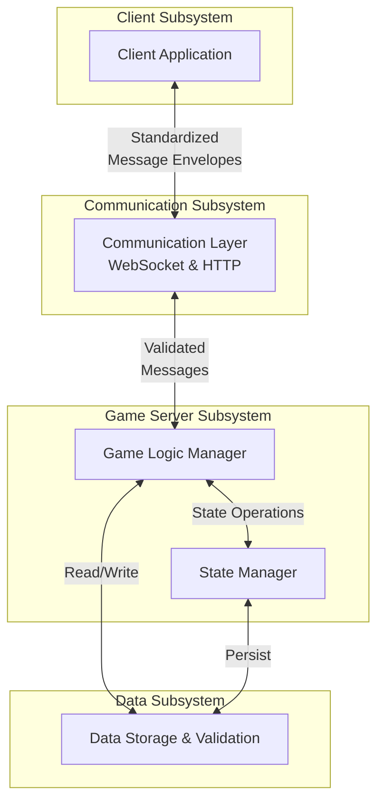

# System Overview

## High-Level Architecture

## Description

The Clue-Less system is built on four major subsystems that communicate through well-defined interfaces:

### Client Subsystem
- Provides user interface for gameplay
- Manages client-side state and user interactions
- Communicates via standardized message envelopes

### Communication Subsystem
- Handles all network communication (WebSocket + HTTP)
- Validates message format and structure
- Routes messages between client and server

### Game Server Subsystem
- Processes game logic and business rules
- Manages game flow and turn order
- Enforces game constraints

### Data Subsystem
- Maintains authoritative game state
- Validates data integrity
- Provides state query and update operations

