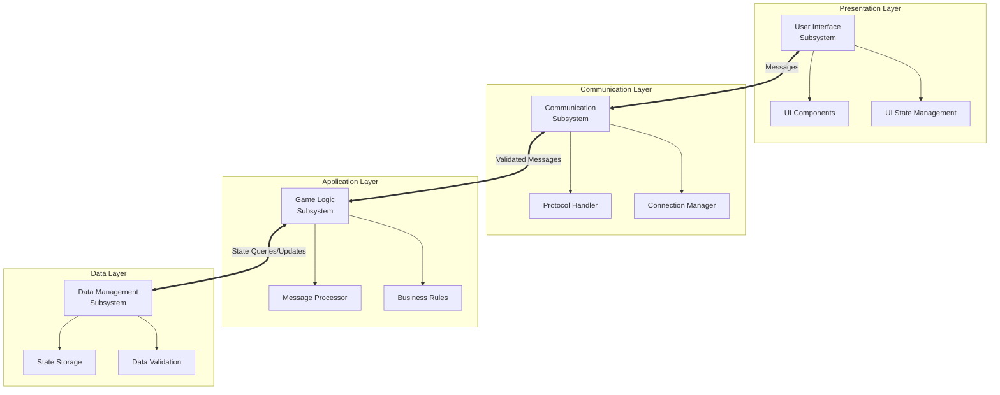

# Subsystem Decomposition

## Detailed Subsystem Breakdown

## Component Descriptions

### Presentation Layer
- **UI Components**: Visual elements for game board, lobby, controls
- **UI State Management**: Client-side state and rendering logic

### Communication Layer
- **Protocol Handler**: Message envelope validation and parsing
- **Connection Manager**: WebSocket lifecycle and reconnection logic

### Application Layer
- **Message Processor**: Routes messages to appropriate handlers
- **Business Rules**: Game logic, turn management, win conditions

### Data Layer
- **State Storage**: In-memory game state persistence
- **Data Validation**: Schema validation and integrity checks

