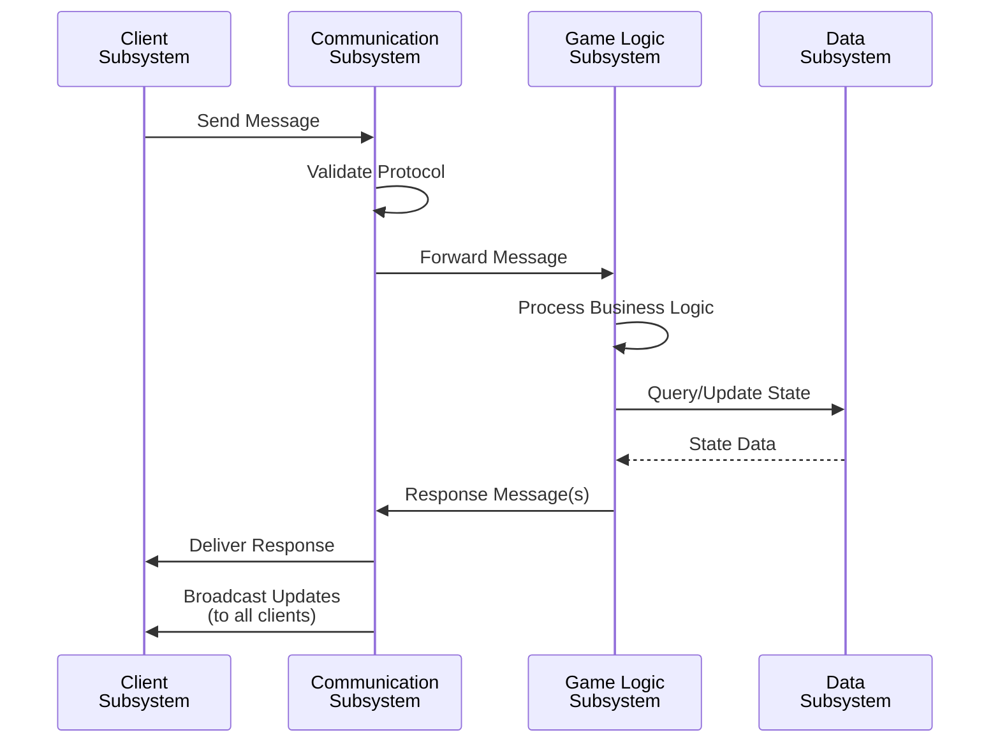

# Message Flow Architecture

## Abstract Message Flow

## Message Flow Patterns

### Request-Response Flow
1. Client sends request message
2. Communication subsystem validates
3. Game logic processes request
4. Data subsystem updates state
5. Response sent back to client

### Broadcast Flow
1. Client sends action message
2. Message validated and processed
3. State updated
4. All connected clients notified of change

### Event-Driven Flow
1. Game event occurs (e.g., player joins)
2. Event handler processes
3. State updated
4. Notifications sent to relevant parties

