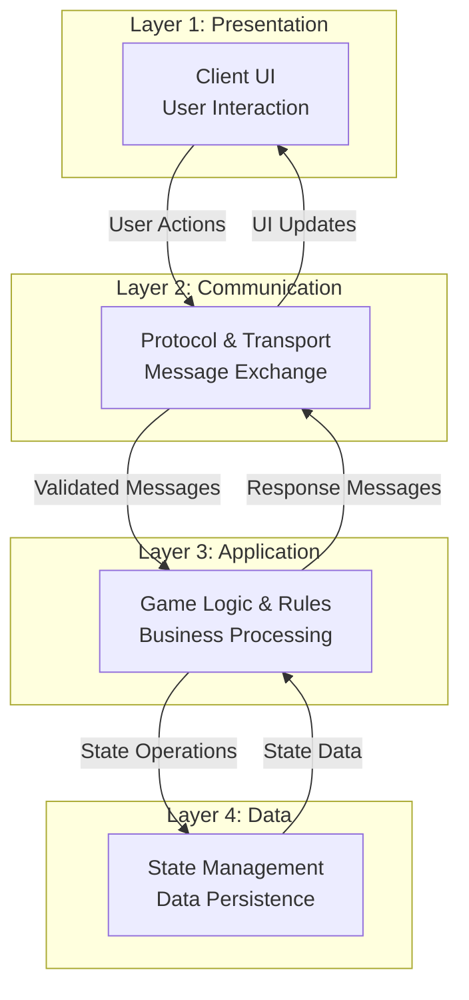

# Layered Architecture

## Four-Tier Architecture

## Layer Responsibilities

### Layer 1: Presentation
**Purpose:** User interaction and display
- Render game interface
- Capture user input
- Display game state
- Manage client-side state

### Layer 2: Communication
**Purpose:** Message transport and protocol
- WebSocket management
- HTTP fallback API
- Message validation
- Protocol enforcement
- Connection handling

### Layer 3: Application
**Purpose:** Business logic and rules
- Process game actions
- Enforce game rules
- Manage game flow
- Handle turn order
- Validate moves and actions

### Layer 4: Data
**Purpose:** State persistence and management
- Store game state
- Manage player data
- Track game progress
- Ensure data integrity
- Provide state queries

## Benefits of Layered Architecture

- **Separation of Concerns**: Each layer has distinct responsibilities
- **Independence**: Layers can be modified without affecting others
- **Testability**: Each layer can be tested independently
- **Scalability**: Layers can be scaled separately
- **Maintainability**: Clear structure simplifies maintenance

