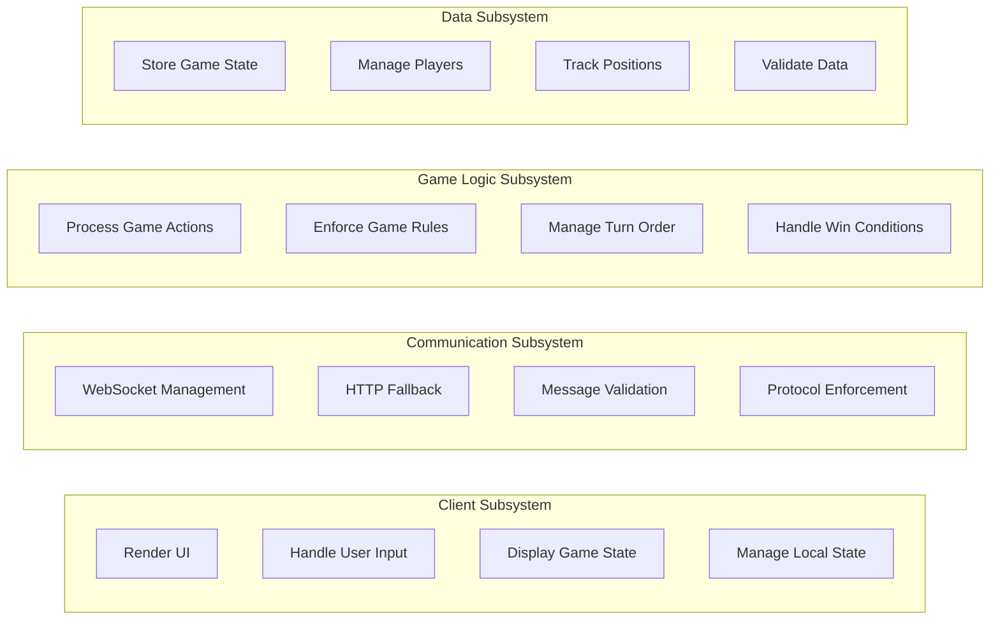

# Subsystem Responsibilities

## Responsibility Distribution

## Detailed Responsibilities

### Client Subsystem
- **Render UI**: Display game board, lobby, controls, and messages
- **Handle User Input**: Process clicks, form submissions, and keyboard input
- **Display Game State**: Show current game state, player positions, and turn info
- **Manage Local State**: Maintain client-side state for responsiveness

### Communication Subsystem
- **WebSocket Management**: Real-time bidirectional communication
- **HTTP Fallback**: Alternative communication for non-WebSocket clients
- **Message Validation**: Ensure messages conform to protocol
- **Protocol Enforcement**: Maintain message envelope standards

### Game Logic Subsystem
- **Process Game Actions**: Handle moves, suggestions, accusations
- **Enforce Game Rules**: Validate actions according to Clue rules
- **Manage Turn Order**: Track whose turn it is and advance turns
- **Handle Win Conditions**: Detect and process game endings

### Data Subsystem
- **Store Game State**: Maintain authoritative game data
- **Manage Players**: Track player information and connections
- **Track Positions**: Monitor player locations on the board
- **Validate Data**: Ensure data integrity and consistency

## Subsystem Independence

Each subsystem can be:
- Developed independently by different teams
- Tested in isolation
- Deployed separately (if needed)
- Modified without affecting other subsystems
- Replaced with alternative implementations

## Inter-Subsystem Communication

All communication between subsystems happens through:
- **Well-defined interfaces**
- **Standardized message formats**
- **Validated contracts**
- **Documented protocols**

