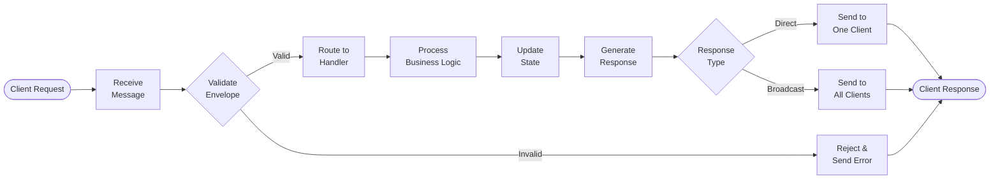

# Message Processing Pipeline

## Processing Pipeline

## Pipeline Stages

### 1. Receive
- Accept incoming message from client
- Parse JSON payload
- Initial error handling

### 2. Validate
- Check message envelope structure
- Verify required fields (type, gameId, payload, ts, version)
- Validate protocol version
- Ensure proper formatting

### 3. Route
- Match message type to handler
- Forward to appropriate business logic
- Handle unknown message types

### 4. Process
- Execute business logic
- Apply game rules
- Validate game state transitions
- Check player permissions

### 5. Update
- Modify game state
- Update player data
- Track game progress
- Maintain consistency

### 6. Respond
- Generate response messages
- Determine recipients (unicast vs broadcast)
- Package data in envelope format
- Send to client(s)

## Error Handling

At each stage, errors are:
- Caught and logged
- Converted to ERROR messages
- Sent back to client
- Include error codes and descriptions

