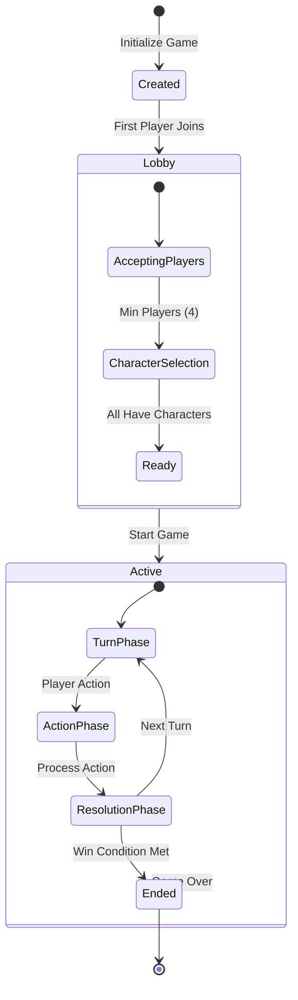

# Game State Lifecycle

## State Transition Diagram

## State Descriptions

### Created
- Game instance initialized
- Unique game ID assigned
- Empty player list
- Waiting for first player

### Lobby
A holding state where players prepare for the game:

#### Accepting Players
- Players join the game (4-6 players)
- Players can leave
- No game actions available yet

#### Character Selection
- Each player selects a unique character
- Players can change characters
- Validates character uniqueness

#### Ready
- Minimum 4 players present
- All players have selected characters
- Game can be started

### Active
The main gameplay state:

#### Turn Phase
- Specific player's turn
- Waiting for player action
- Turn timer (optional)

#### Action Phase
- Player makes move, suggestion, or accusation
- Action validated against game rules
- State updated accordingly

#### Resolution Phase
- Process action results
- Handle suggestions/accusations
- Determine if game continues
- Advance to next player's turn

### Ended
- Win condition met
- Winner declared
- Game statistics available
- No further actions allowed

## State Transitions

### Entry Conditions
- **Created → Lobby**: First player joins
- **Lobby → Active**: START_GAME command with valid conditions
- **Active → Ended**: Correct accusation made

### Exit Conditions
- Players can leave during Lobby
- Active games can be abandoned
- Ended games are archived

