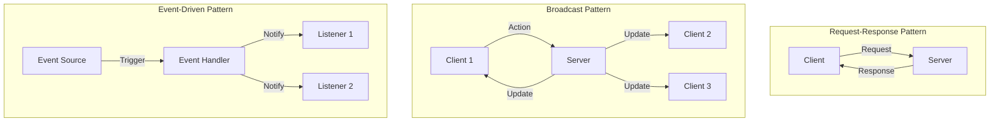

# Communication Patterns

## Message Communication Patterns

## Pattern Descriptions

### Request-Response Pattern
**Use Case:** Direct client-server interaction
- Client sends request (e.g., PING, JOIN_GAME)
- Server processes and responds
- Response goes only to requesting client
- Synchronous-style communication

**Examples:**
- PING → PONG
- JOIN_GAME → INFO, GAME_STATE, YOUR_HAND
- Invalid message → ERROR

### Broadcast Pattern
**Use Case:** State synchronization across all clients
- One client performs action
- Server updates state
- All clients in game receive update
- Keeps all players synchronized

**Examples:**
- Player joins → PLAYER_JOINED broadcast
- Character selected → CHARACTER_SELECTED broadcast
- Chat message → CHAT broadcast
- Game started → GAME_STARTED broadcast

### Event-Driven Pattern
**Use Case:** Asynchronous notifications
- Event occurs in system
- Handler processes event
- Relevant listeners notified
- Decoupled components

**Examples:**
- Player disconnects → Remove from game → Notify others
- Turn ends → Next turn starts → Notify current player
- Suggestion made → Prompt disprove → Notify specific player

## Pattern Selection Criteria

### Use Request-Response When:
- Single client needs information
- Direct confirmation required
- No other clients affected

### Use Broadcast When:
- All players need same information
- State change affects everyone
- Synchronization required

### Use Event-Driven When:
- Asynchronous processing needed
- Specific subset of clients affected
- Decoupling desired

