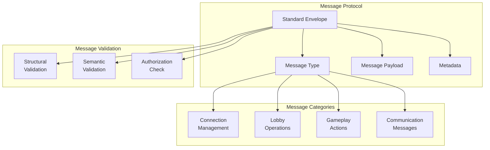

# Protocol & Message Structure

## Message Protocol Structure



## Standard Message Envelope

Every message follows this structure:

```json
{
  "type": "MESSAGE_TYPE",
  "gameId": "game-uuid",
  "payload": { },
  "ts": "2025-10-20T12:00:00.000Z",
  "version": "1.0",
  "requestId": "optional-request-id"
}
```

### Envelope Fields

- **type**: Identifies the message category and action
- **gameId**: References the specific game instance
- **payload**: Contains message-specific data
- **ts**: Timestamp of message creation
- **version**: Protocol version for compatibility
- **requestId**: Optional ID for request-response correlation

## Message Categories

### Connection Management
- INFO: General information
- ERROR: Error notifications
- PING/PONG: Connection health checks

### Lobby Operations
- JOIN_GAME: Join or create game
- PLAYER_JOINED: Player joined notification
- PLAYER_LEFT: Player left notification
- LOBBY_STATE: Current lobby state
- SELECT_CHARACTER: Select game character
- CHARACTER_SELECTED: Character selection confirmed

### Gameplay Actions
- START_GAME: Begin the game
- GAME_STARTED: Game has begun
- TURN_START: Turn begins
- REQUEST_MOVE: Request to move
- PLAYER_MOVED: Move confirmed
- MAKE_SUGGESTION: Make a suggestion
- SUGGESTION_MADE: Suggestion confirmed
- PROMPT_DISPROVE: Ask to disprove
- RESPOND_DISPROVE: Respond with proof
- DISPROVE_RESULT: Disprove outcome
- MAKE_ACCUSATION: Make final accusation
- ACCUSATION_RESOLVED: Accusation result
- GAME_OVER: Game ended

### Communication Messages
- CHAT: Player chat message
- GAME_STATE: Complete game state
- YOUR_HAND: Private card information

## Validation Layers

### Structural Validation
- Valid JSON format
- Required fields present
- Correct data types
- Field constraints (length, range)

### Semantic Validation
- Valid message type
- Appropriate game state for action
- Player permissions
- Game rule compliance

### Authorization
- Player is in the game
- Player's turn (if applicable)
- Player has permissions for action

