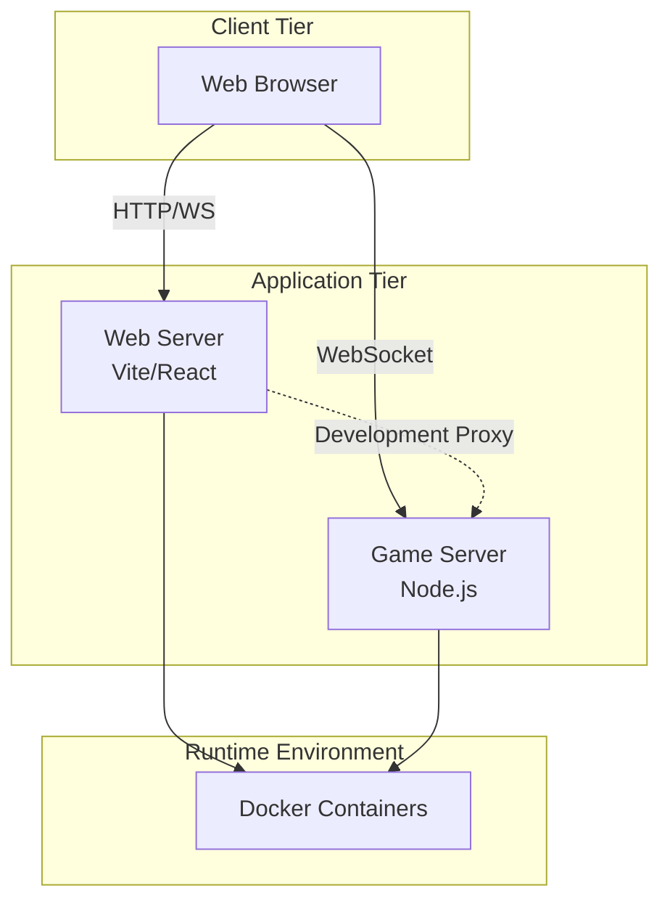

# Deployment Architecture

## Deployment View

## Container Architecture

### Web Container
- **Technology**: Vite development server
- **Port**: 5173
- **Purpose**: Serve React application
- **Features**: Hot reload, development tools

### Server Container
- **Technology**: Node.js + Express
- **Port**: 8080
- **Purpose**: Game server and WebSocket endpoint
- **Features**: Auto-restart on changes (nodemon)

### Container Communication
- Containers communicate via Docker network
- Web server can proxy requests to game server
- Isolated but connected environment

## Network Architecture

### Ports
- **5173**: Web client HTTP/HTTPS
- **8080**: Game server HTTP + WebSocket

### Protocols
- **HTTP**: RESTful fallback API, health checks
- **WebSocket**: Real-time game communication
- **Container Network**: Inter-container communication

## Development vs Production

### Development Mode
- Hot reload enabled
- Debug logging active
- Nodemon for auto-restart
- Source maps available

### Production Mode (Future)
- Optimized builds
- Minified assets
- Production logging
- Reverse proxy (nginx)
- Load balancing support
- Horizontal scaling capability

## Scalability Considerations

### Current Implementation
- Single server instance
- In-memory state
- Suitable for demos and small deployments

### Future Scalability
- Multiple server instances
- Shared state store (Redis, database)
- Load balancer
- Session persistence
- Horizontal scaling

