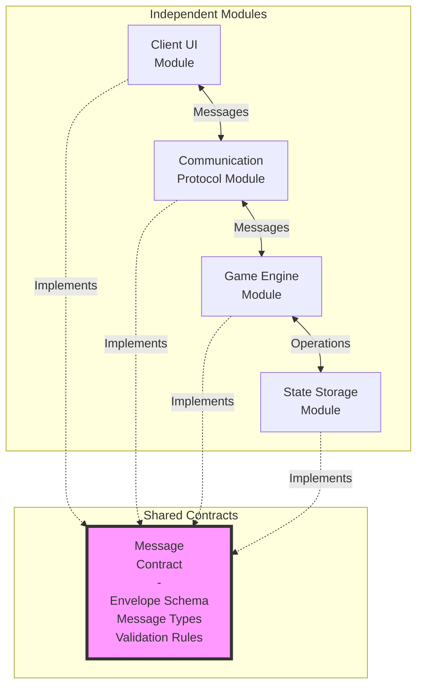

# Modular Independence

## Independent Modules with Shared Contracts

## Module Independence Principles

### Loose Coupling
- Modules communicate only through defined interfaces
- No direct dependencies on implementation details
- Changes in one module don't cascade to others

### Contract-Based Integration
- **Message Contract**: Defines message envelope format
- **Type Contract**: Defines all message types
- **Validation Contract**: Defines validation rules

### Benefits for Development

#### Independent Development
- Different teams can work on different modules
- Parallel development streams
- Reduced merge conflicts
- Clear ownership boundaries

#### Independent Testing
- Each module tested in isolation
- Mock other modules easily
- Unit test without dependencies
- Integration tests verify contracts

#### Independent Deployment
- Modules can be deployed separately
- Incremental updates possible
- Reduced deployment risk
- Easier rollback

### Shared Contract Ensures:
- **Compatibility**: All modules speak same language
- **Consistency**: Standard message format everywhere
- **Validation**: Messages validated at boundaries
- **Documentation**: Contract serves as API documentation

## Module Replacement Strategy

Any module can be replaced as long as it:
1. Implements the shared contract
2. Handles all required message types
3. Maintains validation rules
4. Follows protocol version

### Example Replacements:
- **Client Module**: React → Vue → Angular
- **Communication Module**: WebSocket → gRPC → REST
- **Game Engine Module**: Different game rules
- **State Storage Module**: In-memory → Database → Cloud

