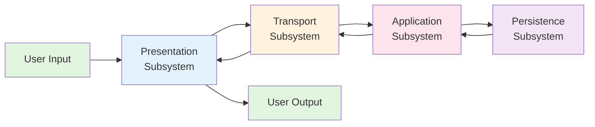

# Data Flow Architecture

## Subsystem Data Flow



## Data Flow Stages

### 1. User Input → Presentation Subsystem
**Data:** User interactions (clicks, form submissions, text input)
**Processing:** 
- Capture user events
- Validate client-side
- Format for transmission

### 2. Presentation → Transport Subsystem
**Data:** Message envelopes (JSON)
**Processing:**
- Serialize to JSON
- Send via WebSocket or HTTP
- Handle connection state

### 3. Transport → Application Subsystem
**Data:** Validated message envelopes
**Processing:**
- Validate message structure
- Parse payload
- Route to handler

### 4. Application → Persistence Subsystem
**Data:** State update operations
**Processing:**
- Query current state
- Apply business rules
- Update state atomically

### 5. Persistence → Application Subsystem (Return)
**Data:** Current state data
**Processing:**
- Retrieve requested data
- Verify data integrity
- Return to application

### 6. Application → Transport Subsystem (Response)
**Data:** Response messages
**Processing:**
- Format response envelopes
- Determine recipients
- Prepare for transmission

### 7. Transport → Presentation Subsystem (Delivery)
**Data:** Response/broadcast messages
**Processing:**
- Deserialize JSON
- Validate response
- Trigger callbacks

### 8. Presentation → User Output
**Data:** Visual updates
**Processing:**
- Update UI components
- Display messages
- Render game state

## Data Transformation Flow

```
User Action
    ↓ (DOM Event)
UI Component
    ↓ (React State)
Message Builder
    ↓ (JSON Object)
WebSocket Client
    ↓ (JSON String)
Network Layer
    ↓ (Binary Stream)
WebSocket Server
    ↓ (JSON Object)
Message Router
    ↓ (Typed Message)
Business Logic
    ↓ (State Update)
Game State
    ↓ (State Data)
Response Builder
    ↓ (JSON Object)
Broadcast/Send
    ↓ (JSON String)
WebSocket Client
    ↓ (JSON Object)
Message Handler
    ↓ (UI Update)
React Component
    ↓ (Visual Change)
User Display
```

## Bidirectional Flow

The system supports full bidirectional communication:

### Client-Initiated
- User actions trigger client requests
- Server processes and responds
- May trigger broadcasts to other clients

### Server-Initiated
- Game events trigger server messages
- State changes broadcast to clients
- Asynchronous notifications

