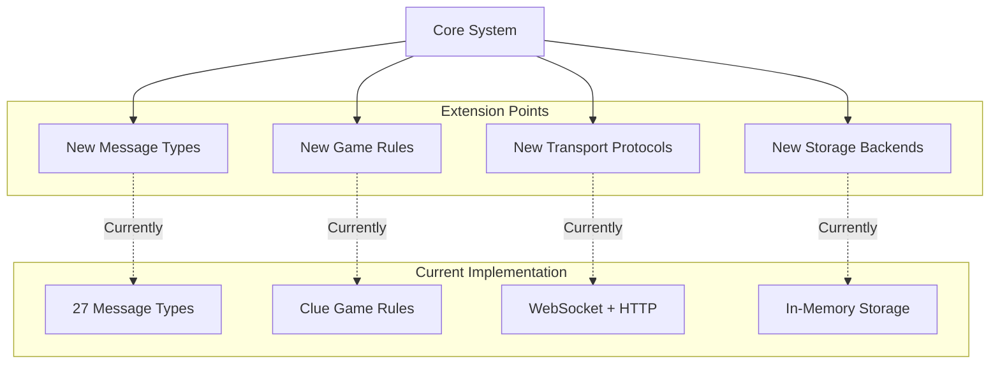

# Scalability & Extension Points

## System Extension Points

## Extension Point Details

### 1. New Message Types
**How to Extend:**
- Add new type to message type registry
- Create handler for new message
- Define payload schema
- Update validation rules

**Examples:**
- SAVE_GAME / LOAD_GAME
- REPLAY_TURN
- SPECTATOR_JOIN
- VOTE_KICK

### 2. New Game Rules
**How to Extend:**
- Implement new handler modules
- Add game-specific logic
- Define new state properties
- Update validation

**Examples:**
- Different board layouts
- Time limits per turn
- Special card powers
- Team-based play

### 3. New Transport Protocols
**How to Extend:**
- Implement protocol adapter
- Maintain message contract
- Add transport layer
- Update routing

**Examples:**
- gRPC
- Server-Sent Events (SSE)
- Long polling
- WebRTC data channels

### 4. New Storage Backends
**How to Extend:**
- Implement storage interface
- Maintain state schema
- Add persistence layer
- Update state manager

**Examples:**
- PostgreSQL database
- MongoDB
- Redis
- Cloud storage (AWS, GCP)

## Scalability Strategies

### Horizontal Scaling
- Multiple server instances
- Load balancer distribution
- Shared state store
- Session affinity

### Vertical Scaling
- Optimize message processing
- Efficient state management
- Connection pooling
- Caching strategies

### Performance Optimization
- Message batching
- State delta updates
- Lazy loading
- Compression

## Future Enhancements

### Short-term
- Persistent storage
- Game replay
- Spectator mode
- Enhanced error recovery

### Long-term
- Multiple game types
- Tournament system
- Analytics and statistics
- AI opponents
- Mobile clients

